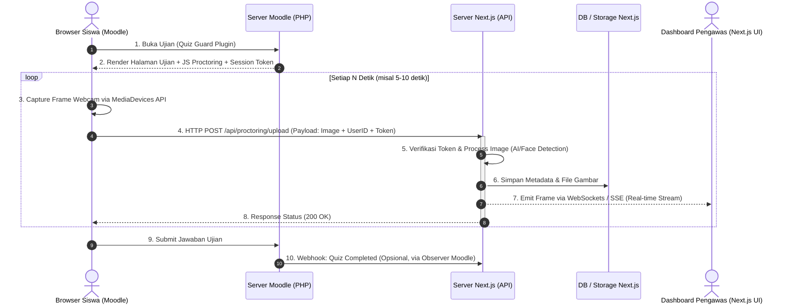

### Deskripsi Fitur
Implementasi sistem pengawasan ujian (*proctoring*) berbasis *webcam* secara *real-time* yang menghubungkan antarmuka Moodle (Siswa) dengan *Dashboard* Next.js (Pengawas). 

Sistem ini akan melakukan penangkapan gambar (*Webcam Frame*) dari browser siswa secara berkala saat ujian berlangsung dan mendistribusikannya ke *Dashboard* pengawas.

### Alur Sistem (Sequence Diagram)

### Kebutuhan Teknis (*Task Breakdown*)
- [ ] **Moodle (quizaccess_guard):**
  - Injeksi *script* JavaScript (JS Proctoring) menggunakan API Moodle ke dalam halaman `attempt.php`.
  - Generate *Session Token* aman untuk diberikan ke klien agar bisa dipakai menembak API Next.js.
  - (Opsional) Trigger *Webhook Event Observer* (`quiz_attempt_submitted`) ke Next.js.
- [ ] **Next.js (exam-guard):**
  - Pembuatan API *Endpoint* `POST /api/proctoring/upload` untuk menerima *frame* dan melakukan verifikasi token.
  - Implementasi *middleware* atau *service* untuk pemrosesan AI/*Face Detection* ringan.
  - Pembuatan skema *Database* (Prisma) dan *Storage* untuk mencatat Metadata dan log *screenshot*.
  - Pembuatan *channel* WebSocket / Server-Sent Events (SSE) untuk mendorong data ke Pengawas.
  - Menyesuaikan UI *Unified Proctor Cockpit* untuk merender *stream* gambar siswa secara *real-time*.
